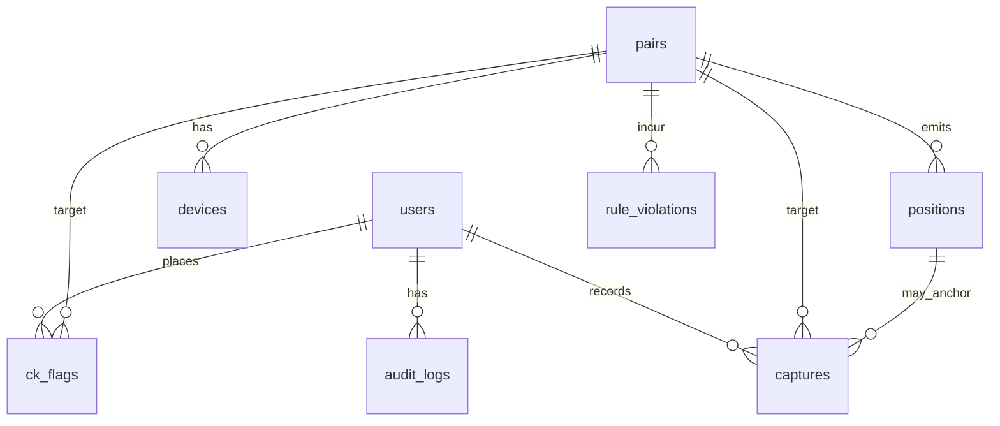

# Adatbázis séma

  

> **Szerepe:** A Célkereszt backend **PostgreSQL** perzisztens modellje és a mellé rendelt **Redis** réteg szerepkörének **egy helyen** való leírása **az üzemeltetők és fejlesztők számára**.

---

### Tartalom

1. [Kétrétegű adattárolás](#1-kétrétegű-adattárolás)
2. [PostgreSQL: táblák A–Z](#2-postgresql-táblák-az)
3. [Kapcsolatok és integritás](#3-kapcsolatok-és-integritás)
4. [Redis: szerepkör és kulcsok](#4-redis-szerepkör-és-kulcsok)
5. [Üzemeltetési irányelvek](#5-üzemeltetési-irányelvek)
6. [Kapcsolódó dokumentumok](#6-kapcsolódó-dokumentumok)

---

## 1. Kétrétegű adattárolás

| Rendszer | Mit tárol | Miért |
|----------|-----------|--------|
| **PostgreSQL** | Felhasználók, párok, eszközök, pozíciók története, játéknapok, beállítások, geofence-ek, szabályszegések, audit, stb. | ACID, hosszú távú historikus adat, riport/export, gépi naplók |
| **Redis** | Rövid élettartamú, nagy fordulatszámú állapot: legutóbbi élő GPS, aktív üldöző pontok a térképről, maradás-szabály időzítők, geofence cache | Gyors olvasás a játékmotor és a websockets felé; nem helyettesíti az SQL-t |

A TypeORM entitások forrása: `backend/src/entities/*.entity.ts`. A production környezetben **`synchronize: false`**; séma változáshoz migráció vagy vezérelt DDL szükséges.

---

## 2. PostgreSQL: táblák A–Z

Az oszlopnevek ott **ahogy a táblában** szerepelnek (a `pairs` táblán a TypeORM alapbeállítás miatt maradt **`assignedNumber`**, **`createdAt`**, **`updatedAt`** stílusú mezőnév — SQL-ben gyakran idézőjelbe kell tenni). A táblák a **`backend/src/entities`** entitások és a production séma szerint állnak össze.

---

### `audit_logs`

Admin (és egyes gépi) műveletek nyoma: ki, mit, mikor; rugalmas `data_json` mellékletekkel.

| Oszlop | Típus (PostgreSQL) | Kötelező | Megjegyzés |
|--------|---------------------|----------|------------|
| `id` | `integer` / serial | igen | PK |
| `user_id` | `integer` | nem | FK → `users.id`; rendszer-esemény lehet üres |
| `action_type` | `varchar` | igen | Pl. tábla + művelet azonosító (alkalmazás-konvenció) |
| `entity_type` | `varchar` | nem | Érintett entitás fajtája |
| `entity_id` | `integer` | nem | Érintett rekord azonosító |
| `data_json` | `jsonb` | nem | Részletes payload export / visszanézéshez |
| `ip_address` | `varchar(45)` | nem | IPv4 / IPv6 |
| `user_agent` | `text` | nem | Kliens string |
| `timestamp` | `timestamptz` | igen | Esemény időpontja (létrehozás) |

**Indexek (jellemző):** `user_id`, `action_type`, `timestamp`.

**Kapcsolat:** `users` (opcionális FK).

---

### `captures`

Pár elfogása (bilincs folyamat): melyik tisztviselő, milyen ponton, opcionális kliens- és pozíció-hivatkozás.

| Oszlop | Típus | Kötelező | Megjegyzés |
|--------|-------|----------|------------|
| `id` | `integer` | igen | PK |
| `pair_id` | `integer` | igen | FK → `pairs.id` CASCADE |
| `captured_by_user_id` | `integer` | igen | FK → `users.id` |
| `location_id` | `integer` | nem | FK → `positions.id` — mely mintára hivatkozunk |
| `request_id` | `varchar(100)` | nem | Idempotencia / dedupe; egyedi, ha nem NULL |
| `client_timestamp` | `timestamp` | nem | Kliens ideje |
| `timestamp` | `timestamptz` | igen | Szerver oldali rögzítés (kanonikus) |
| `captured_lat` | `double precision` | nem | Elfogás pillanatában mentett lat |
| `captured_lon` | `double precision` | nem | Elfogás pillanatában mentett lon |
| `created_at` | `timestamptz` | igen | Sor beszúrása |

**Kényszer:** egyedi `pair_id` (egy élő elfogás / pár modell szerint).

**Indexek:** PK; egyedi `(pair_id)`; egyedi `(request_id)` amennyiben kitöltve.

---

### `ck_flags`

Operátori „Célkereszt” jelölés egy párhoz — aktív jelzővel és időbélyegekkel.

| Oszlop | Típus | Kötelező | Megjegyzés |
|--------|-------|----------|------------|
| `id` | `integer` | igen | PK |
| `pair_id` | `integer` | igen | FK → `pairs.id` CASCADE |
| `flagged_by_user_id` | `integer` | igen | FK → `users.id` |
| `active` | `boolean` | igen | Alapértelmezett `true` |
| `timestamp` | `timestamp` | igen | Esemény bélyeg (INSERT-nél tipikusan „most”) |
| `created_at` | `timestamp` | igen | Sor létrejötte |

**Indexek:** `pair_id`, `active`.

---

### `devices`

Mobil eszköz regisztráció **párként egy darab** (egyedi `pair_id` és egyedi `imei_or_device_id`).

| Oszlop | Típus | Kötelező | Megjegyzés |
|--------|-------|----------|------------|
| `id` | `integer` | igen | PK |
| `pair_id` | `integer` | igen | FK → `pairs.id` CASCADE |
| `imei_or_device_id` | `varchar` | igen | Stabil device id |
| `fcm_token` | `text` | nem | Push regisztráció |
| `last_seen_at` | `timestamp` | nem | Utolsó szerverszintű aktivitás |
| `logged_out_at` | `timestamp` | nem | Kijelentkezéskor; login törölheti |
| `created_at` | `timestamp` | igen | |
| `updated_at` | `timestamp` | igen | |

**Kényszerek:** egyedi `pair_id`; egyedi `imei_or_device_id`.

---

### `game_days`

Ütemezett játéknapok: naptári nap + napi **`start_time` / `end_time`** és opcionális `special_rules_json`.

| Oszlop | Típus | Kötelező | Megjegyzés |
|--------|-------|----------|------------|
| `id` | `integer` | igen | PK |
| `date` | `date` | igen | Naptári nap |
| `start_time` | `time` | igen | Ablak kezdete (napon belül) |
| `end_time` | `time` | igen | Ablak vége |
| `special_rules_json` | `jsonb` | nem | Extrák / finomhangolás |
| `created_at` | `timestamp` | igen | |
| `updated_at` | `timestamp` | igen | |

**Index:** tipikusan `date`.

---

### `game_runtime_state`

A játékmotor **aktuális** pillanatképe egyetlen sorban — kampány státusz, aktív nap, ciklus időablakai, élő pozíció engedélyezés admin térképre, stb.

| Oszlop | Típus | Kötelező | Megjegyzés |
|--------|-------|----------|------------|
| `id` | `integer` | igen | PK |
| `campaign_status` | `varchar` | igen | Pl. `IDLE`, `RUNNING`, `PAUSED_BETWEEN_DAYS`, `FINISHED` |
| `active_game_day_id` | `integer` | nem | **Logikai** hivatkozás `game_days.id`-re *(FK nélkül is előfordulhat a sémában)* |
| `current_cycle_start_at` | `timestamp` | nem | |
| `current_cycle_end_at` | `timestamp` | nem | |
| `allow_position_updates_for_map` | `boolean` | igen | Térképes frissítés kapu |
| `last_cycle_turn_at` | `timestamp` | nem | |
| `last_map_position_at` | `timestamp` | nem | |
| `pairs_sent_position_this_cycle` | `text` | nem | TypeORM `simple-array` → vesszővel elválasztott listaként tárolva |
| `last_applied_area_schedule_key` | `varchar` | nem | Geofence / terület ütem egyeztetése |
| `updated_at` | `timestamp` | igen | Utolsó módosítás |

Gyakorlatban **egy élő állapotsort** tart a szolgáltatás.

---

### `game_settings`

Globális kapcsolók és parametrizálás — **logikai singleton** (egy releváns konfig sor).

| Oszlop | Típus | Kötelező | Megjegyzés |
|--------|-------|----------|------------|
| `id` | `integer` | igen | PK |
| `location_update_interval_minutes` | `integer` | igen | Mobil hely küldés elvárás / UI |
| `game_enabled` | `boolean` | igen | Fő kapcsoló |
| `stay_rule_enabled` | `boolean` | igen | Napi „maradj a bázishoz közel” szabály |
| `stay_radius_km` | `double precision` | igen | Sugár km-ben |
| `mobile_enrollment_secret` | `varchar(255)` | nem | Mobil fejléc-titok; `.env`-ben felülírható |
| `created_at` | `timestamp` | igen | |
| `updated_at` | `timestamp` | igen | |

---

### `geofences`

Játékterület-zónák: lehet **`game_area`** (ország/fő játékterület — típus szerint vármegye-polygon a `metadata_json`-ban), vagy **`scenario`** (egyedi, extra játékterület‑kör/poligon — ugyanaz a geometria-modell).

A **`game_area_exit`** szabálymotorban a „játékterület határa” az aktív **`game_area` és `scenario` zónák uniója**: ha egy pont egyikben sincs geometriában (és ha meg van adva, az `active_from`–`active_until` időablakban sem), úgy tekinthető kintinek → szabályszegés indulhat. A `positions.saved_area_context_json` továbbra is külön rögzíti az adott mintánál érvényes `game_area` ID-ket és scenario körök adatait (visszanézéshez).

| Oszlop | Típus | Kötelező | Megjegyzés |
|--------|-------|----------|------------|
| `id` | `integer` | igen | PK |
| `name` | `varchar` | igen | |
| `center_lat` | `numeric(10,8)` | igen | |
| `center_lon` | `numeric(11,8)` | igen | |
| `radius_m` | `integer` | igen | Méterben |
| `active` | `boolean` | igen | |
| `active_from` | `timestamp` | nem | Időfüggő aktiválás kezdete |
| `active_until` | `timestamp` | nem | Időfüggő aktiválás vége |
| `geofence_type` | `varchar` | igen | `game_area` (fő térség) \| `scenario` (extra játékterület‑kör) |
| `metadata_json` | `jsonb` | nem | Extra meta |
| `created_at` | `timestamp` | igen | |
| `updated_at` | `timestamp` | igen | |

**Indexek:** `active`, `geofence_type`.

---

### `pairs`

Játékban részt vevő párok: külső látható **`assignedNumber`**, opcionális név.

| Oszlop | Típus | Kötelező | Megjegyzés |
|--------|-------|----------|------------|
| `id` | `integer` | igen | PK |
| `assignedNumber` | `integer` | igen | Egyedi, mobil login azonosító számként |
| `name` | `varchar` | nem | Megjelenített név |
| `active` | `boolean` | igen | |
| `createdAt` | `timestamp` | igen | *Megjegyzés: camelCase oszlopnév* |
| `updatedAt` | `timestamp` | igen | |

**Index:** egyedi `assignedNumber`.

---

### `positions`

Történeti és admin riport GPS minták. Tartalmaz **játékterület kontextust** és szabály jelzőt mentéskor.

| Oszlop | Típus | Kötelező | Megjegyzés |
|--------|-------|----------|------------|
| `id` | `integer` | igen | PK |
| `pair_id` | `integer` | igen | FK → `pairs.id` CASCADE |
| `lat` / `lon` | `numeric` | igen | Tipikusan `(10,8)` / `(11,8)` skála |
| `accuracy` | `numeric` | nem | Opcionális pontosság |
| `speed` | `numeric` | nem | Opcionális sebesség |
| `vehicle_mode` | `boolean` | igen | Jármű mód aktív-e |
| `vehicle_session_remaining` | `integer` | nem | Másodperc / szerver konvenció szerint |
| `timestamp` | `timestamp` | igen | Minta időpontja |
| `created_at` | `timestamp` | igen | Beszúrás |
| `had_rule_violation_at_save` | `boolean` | igen | Mentéskor volt-e szabálysértés |
| `saved_area_context_json` | `jsonb` | nem | Fix és scenario körök pillanatképe |

**Indexek:** `pair_id`, `timestamp`, összetett `(pair_id, timestamp)`.

---

### `rule_violations`

Automatikus vagy gépi szabályszegések: típus szerint szűrhető/kategorizálható.

| Oszlop | Típus | Kötelező | Megjegyzés |
|--------|-------|----------|------------|
| `id` | `integer` | igen | PK |
| `pair_id` | `integer` | igen | FK → `pairs.id` CASCADE |
| `violation_type` | `varchar` | igen | Pl. **`game_area_exit`**, **`vehicle_time_exceeded`**, **`end_of_day_stay`** |
| `description` | `text` | nem | Emberi olvasható részlet |
| `resolved` | `boolean` | igen | Feloldva-e |
| `resolved_at` | `timestamptz` | nem | Feloldás ideje |
| `created_at` | `timestamptz` | igen | Létrejött |

**Indexek:** `pair_id`, `resolved`.

---

### `users`

Web admin és tisztviselői fiókok.

| Oszlop | Típus | Kötelező | Megjegyzés |
|--------|-------|----------|------------|
| `id` | `integer` | igen | PK |
| `username` | `varchar` | igen | Egyedi |
| `email` | `varchar` | nem | Egyedi, ha megadva |
| `password_hash` | `varchar` | igen | |
| `role` | `varchar` | igen | Pl. `admin`, `officer` |
| `active` | `boolean` | igen | |
| `created_at` | `timestamp` | igen | |
| `updated_at` | `timestamp` | igen | |

---

## 3. Kapcsolatok és integritás

**Összefoglalva:**

- A **`pairs`** tábla középponti: rá mutatnak a mobil eszköz, pozíciók, elfogások, CK jelölések és szabályszegések. A **`geofences`** sorok önálló konfigurációk — nincs külön „teljesítés” tábla pár és scenario között.
- A **`users`** tábla kapcsolódik az audit sorokhoz, az elfogást rögzítő tiszthez és a CK jelölőhöz.
- **`game_days`** és **`game_runtime_state`** között a kapcsolat **azonosító szintű** (`active_game_day_id`); FK hiányában az integritást az alkalmazás réteg tartja.
- Sok gyerek táblán **`ON DELETE CASCADE`** a párra — párt törölve törlődnek a rá épülő rekordok (pozíció, eszköz, stb.), **kivéve** a felhasználóra mutató hivatkozások tiltott törlése esetén.

---

## 4. Redis: szerepkör és kulcsok

A Redis **nem** másodlagos „adatbázis” a riportáláshoz: ideiglenes, újragenerálható vagy nagyon gyorsan változó állapot tárolására való. **A PostgreSQL marad a tartós adatforrás** — hosszútávú előzmények, audit, riport/export, és általában minden olyan rekord, amelynél a megmaradás **nem** függhet attól, hogy a cache üres-e vagy a folyamat újraindult-e.

Implementáció: `backend/src/redis/*.service.ts`.

### Összkép

| Cél | Szolgáltatás | Mit tesz |
|-----|----------------|----------|
| **Élő pár‑GPS** | `RedisPositionService` | Mobil legutóbbi mintája TTL-lel (`ck:live:position:{pairId}`) — térkép/frissítés a mentett Postgres sor előtt/el mellett |
| **Maradás-szabály (stay)** | `RedisPositionService` + `RedisStayRuleService` | Nap végére rögzített **anchor** (`ck:stay:anchor:{ymd}:{pairId}`); „kint vagyunk” óta (`outside_since`), kilépésre figyelmeztetés deduplikálása; a térképen való **láthatósági időablak vége** `PXAT` kulccsal tárolva |
| **Aktív geofence sorok cache** | `RedisGeofenceCacheService` | `game_area` és `scenario` (extra játékterület‑kör) sorok JSON cache-ben — szabályok / területpillanatképekhez; admin változáskor invalidálás |
| **Üldöző böngésző GPS** | `RedisPursuerPositionService` | Webes tiszti pozíció rövid TTL-lel kulcsonként (`ck:pursuer:pos:{userId}`) — pl. kampány vég távolságos push szöveghez |

### Kulcsprefixek és tipikus TTL

| Kulcsminta | Tartalom | TTL / lejárat |
|------------|----------|----------------|
| `ck:live:position:{pairId}` | JSON: lat, lon, accuracy, speed, vehicle*, timestamp ISO | ~45 perc (`EX`) |
| `ck:stay:anchor:{ymd}:{pairId}` | JSON: bázis lat/lon a stay szabályhoz | ~14 nap (`EX`) |
| `ck:stay:outside_since:{ymd}:{pairId}` | ISO idő első „kinti” pillanatról | ~14 nap |
| `ck:stay:exit_warn:{ymd}:{pairId}` | `"1"` ha már küldtünk exit warningot | ~14 nap |
| `ck:stay:map_reveal_until:{pairId}` | ISO + `PXAT`: térképláthatóság vége következő nap elejétől számított ablakban | pontos UTC lejárat |
| `ck:cache:geofences:active:game_area` | Aktív geofence sor tömb JSON-ban | ~10 perc + manuális invalidálás |
| `ck:cache:geofences:active:scenario` | Aktív **`scenario`** (extra játékterület‑kör) sorok tömbje | ~10 perc + invalidálás |
| `ck:pursuer:pos:{userId}` | JSON: lat, lon, ts | ~120 mp |

Új példányoknak **üres Redis** elfogadható induláskor: a cache és az élő kulcsok fokozatosan újratöltődnek az első írásokkal / lekérdezésekkel (a funkciófüggő mellékhatásokat lásd az üzemeltetői dokumentációban).

---

## 5. Üzemeltetési irányelvek

- **Séma:** változáskor a dokumentáció és egy éles kompatibilis DDL migráció együttes frissítése ajánlott.
- **Singletonok:** `game_settings` és `game_runtime_state` esetén alkalmazásrétegben előzd meg a több konkurens „élő” sor problémáját.
- **`pairs` CamelCase:** SQL-ben idézőjelezzük az oszlopneveket; új táblák lehetőség szerint `snake_case` konvenciót követhetnek migrációnál — ez önálló, breaking változásként érdemes tervezni.

---

## 6. Kapcsolódó dokumentumok

| Dokumentum | Témakör |
|------------|---------|
| [API_SPEC.md](API_SPEC.md) | REST végpontok és auth |
| [WEBSOCKET_EVENTS.md](WEBSOCKET_EVENTS.md) | Valós idejű események |
| [INSTALLATION.md](INSTALLATION.md) | Lokális DB és Redis indulás |
